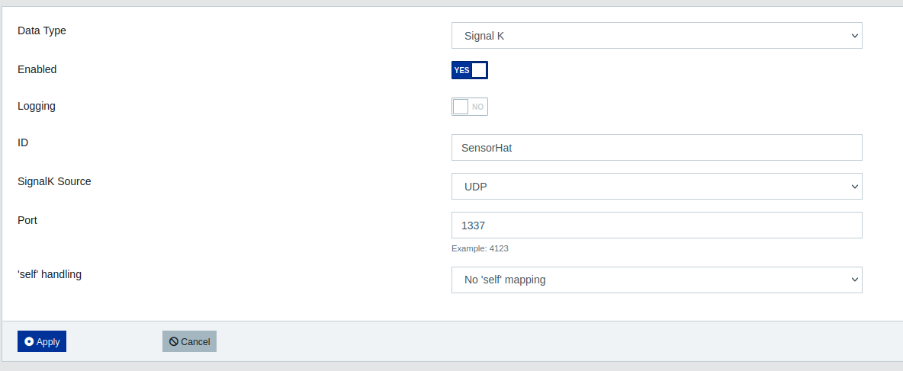

# sensehat-to-signalk

Simple and barebone script to get Rasperry Pi Sensor HAT enviromental data into SignalK. IMU data is passed via pyPilot.

## Installation

### Package requirements

``` 
sudo apt-get install sense-hat
```

### Cloning repository

```
git clone https://github.com/schemen/sensehat-to-signalk.git && cd sensehat-to-signalk
```

### Check settings and start program
It is easiest if you start it in a screen multiplexer like `tmux`.

```
tmux
python3 sts.py
```

### Add sensor to SignalK

Visit your SignalK Server, `Server -> Data Connections -> Add` and configure the new sensor with the following settings:

